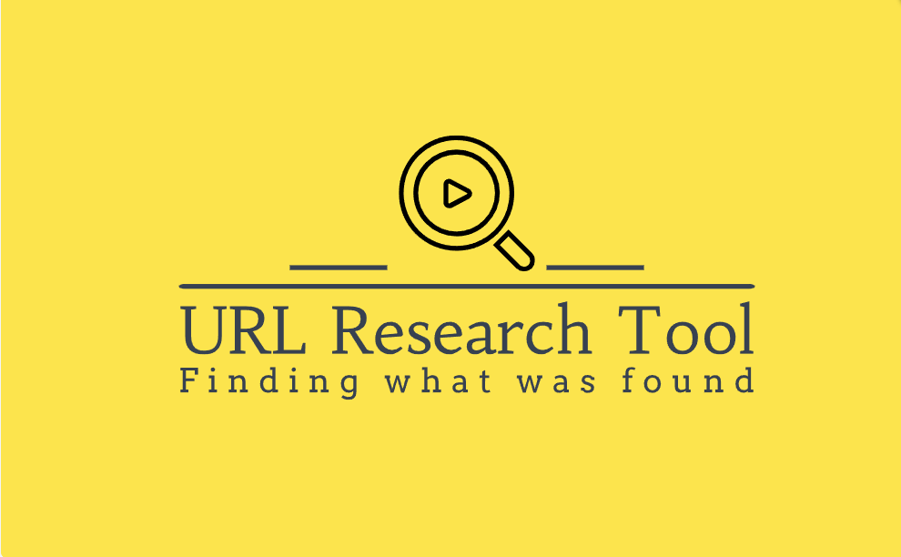
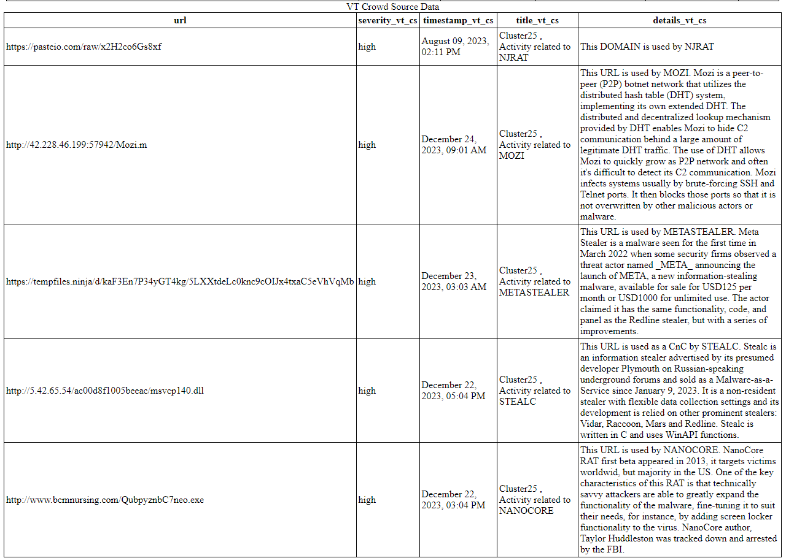

<div id="top"></div>
<!--
*** Thanks for checking out the Best-README-Template. If you have a suggestion
*** that would make this better, please fork the repo and create a pull request
*** or simply open an issue with the tag "enhancement".
*** Don't forget to give the project a star!
*** Thanks again! Now go create something AMAZING! :D
-->


<!-- PROJECT SHIELDS -->
<!--
*** I'm using markdown "reference style" links for readability.
*** Reference links are enclosed in brackets [ ] instead of parentheses ( ).
*** See the bottom of this document for the declaration of the reference variables
*** for contributors-url, forks-url, etc. This is an optional, concise syntax you may use.
*** https://www.markdownguide.org/basic-syntax/#reference-style-links
-->

[![Contributors][contributors-shield]][contributors-url]
[![Forks][forks-shield]][forks-url]
[![Stargazers][stars-shield]][stars-url]
[![Issues][issues-shield]][issues-url]
[![MIT License][license-shield]][license-url]


<!-- PROJECT LOGO -->
<br />
<div align="center">
  <a href="https://github.com/JochiRaider/URL_Research_Tool/blob/main/images/Screenshot%202023-12-26.png">
    
  </a>


<h3 align="center">URL Research Tool</h3>

  <p align="center">
    This Proof of Concept (PoC) project provides an integrated security analysis tool that checks URLs and domains against multiple security threat databases. It uses APIs from VirusTotal, Google Safe Browsing, IPQualityScore, and URLHaus to assess and compile data on potential threats, providing outputs in both CSV and HTML formats.
  <br/>  
  <h4>Features</h4>
  <li>API Integration: Seamless use of VirusTotal, Google Safe Browsing, IPQualityScore, and URLHaus APIs.
  <li>Comprehensive Reports: Outputs are provided in CSV for data analysis and HTML for user-friendly views.
  <li>Configurable: Uses a configuration file (api_config.txt) to manage API keys and endpoints, allowing for easy updates.    
  <br/>
    <a href="https://github.com/JochiRaider/URL_Research_Tool"><strong>Explore the docs »</strong></a>
    <br/>
    <br/>
    <a href="https://github.com/JochiRaider/URL_Research_Tool">View Demo</a>
    ·
    <a href="https://github.com/JochiRaider/URL_Research_Tool/issues">Report Bug</a>
    ·
    <a href="https://github.com/JochiRaider/URL_Research_Tool/issues">Request Feature</a>
  </p>
</div>


<!-- TABLE OF CONTENTS -->
<details>
  <summary>Table of Contents</summary>
  <ol>
    <li>
      <a href="#about-the-project">About The Project</a>
      <ul>
        <li><a href="#built-with">Built With</a></li>
      </ul>
    </li>
    <li>
      <a href="#getting-started">Getting Started</a>
      <ul>
        <li><a href="#prerequisites">Prerequisites</a></li>
        <li><a href="#installation">Installation</a></li>
      </ul>
    </li>
    <li><a href="#usage">Usage</a></li>
    <li><a href="#roadmap">Roadmap</a></li>
    <li><a href="#contributing">Contributing</a></li>
    <li><a href="#license">License</a></li>
    <li><a href="#contact">Contact</a></li>
    <li><a href="#acknowledgments">Acknowledgments</a></li>
  </ol>
</details>


<!-- ABOUT THE PROJECT -->
## About The Project
<div align="center">



</div>
<p align="right">(<a href="#top">back to top</a>)</p>


### Built With

* [Python](https://www.python.org/)
* [Virus Total](https://docs.virustotal.com/)
* [Google Safe Browsing (v4)](https://developers.google.com/safe-browsing/v4/lookup-api)
* [URLHaus](https://urlhaus.abuse.ch/)
* [IP Quality Score](https://www.ipqualityscore.com/documentation/malicious-url-scanner-api/overview)

<p align="right">(<a href="#top">back to top</a>)</p>


<!-- GETTING STARTED -->
## Getting Started

This is an example of how you may give instructions on setting up your project locally.
To get a local copy up and running follow these simple example steps.

### Prerequisites

This is an example of how to list things you need to use the software and how to install them.
* requests
  ```sh
  pip install requests
  ```

### Installation

1. Get a free API Key at [https://example.com](https://example.com)
2. Clone the repo
   ```sh
   git clone https://github.com/JochiRaider/URL_Research_Tool.git
   ```
3. Install requests library 
   ```sh
   pip install requests
   ```
4. Enter your API in `api_config.txt`
   ```py
   {  "virustotal":{"key":"=","url_url":"https://www.virustotal.com/api/v3/urls/"},
      "googlesafebrowser":{"key":"=","ID":"domain-reputation-408400","url":"https://safebrowsing.googleapis.com/v4/threatMatches:find"},
      "ipqualityscore":{"key":"=","url":"https://www.ipqualityscore.com/api/json/url/"},
      "urlscanio":{"key":"=","url":"https://urlscan.io/api/v1/scan/"}
   }
   ```

<p align="right">(<a href="#top">back to top</a>)</p>


<!-- USAGE EXAMPLES -->
## Usage

To run the project, execute the main.py script:


<p align="right">(<a href="#top">back to top</a>)</p>


<!-- ROADMAP -->
## Roadmap

- [] Feature 1
- [] Feature 2
- [] Feature 3
    - [] Nested Feature

See the [open issues](https://github.com/JochiRaider/URL_Research_Tool/issues) for a full list of proposed features (and known issues).

<p align="right">(<a href="#top">back to top</a>)</p>


<!-- CONTRIBUTING -->
## Contributing

Contributions are what make the open source community such an amazing place to learn, inspire, and create. Any contributions you make are **greatly appreciated**.

If you have a suggestion that would make this better, please fork the repo and create a pull request. You can also simply open an issue with the tag "enhancement".
Don't forget to give the project a star! Thanks again!

1. Fork the Project
2. Create your Feature Branch (`git checkout -b feature/AmazingFeature`)
3. Commit your Changes (`git commit -m 'Add some AmazingFeature'`)
4. Push to the Branch (`git push origin feature/AmazingFeature`)
5. Open a Pull Request

<p align="right">(<a href="#top">back to top</a>)</p>


<!-- LICENSE -->
## License

Distributed under the MIT License. See `LICENSE.txt` for more information.

<p align="right">(<a href="#top">back to top</a>)</p>


<!-- CONTACT -->
## Contact

Project Link: [https://github.com/JochiRaider/URL_Research_Tool](https://github.com/JochiRaider/URL_Research_Tool)

<p align="right">(<a href="#top">back to top</a>)</p>


<!-- ACKNOWLEDGMENTS -->
## Acknowledgments

* []()
* []()
* []()

<p align="right">(<a href="#top">back to top</a>)</p>

https://github.com/JochiRaider/URL_Research_Tool

<!-- MARKDOWN LINKS & IMAGES -->
<!-- https://www.markdownguide.org/basic-syntax/#reference-style-links -->
[contributors-shield]: https://img.shields.io/github/contributors/JochiRaider/URL_Research_Tool.svg?style=for-the-badge
[contributors-url]: https://github.com/JochiRaider/URL_Research_Tool/graphs/contributors
[forks-shield]: https://img.shields.io/github/forks/JochiRaider/URL_Research_Tool.svg?style=for-the-badge
[forks-url]: https://github.com/JochiRaider/URL_Research_Tool/network/members
[stars-shield]: https://img.shields.io/github/stars/JochiRaider/URL_Research_Tool.svg?style=for-the-badge
[stars-url]: https://github.com/JochiRaider/URL_Research_Tool/stargazers
[issues-shield]: https://img.shields.io/github/issues/JochiRaider/URL_Research_Tool.svg?style=for-the-badge
[issues-url]: https://github.com/JochiRaider/URL_Research_Tool/issues
[license-shield]: https://img.shields.io/github/license/JochiRaider/URL_Research_Tool.svg?style=for-the-badge
[license-url]: https://github.com/JochiRaider/URL_Research_Tool/blob/master/LICENSE.txt
[linkedin-shield]: https://img.shields.io/badge/-LinkedIn-black.svg?style=for-the-badge&logo=linkedin&colorB=555

[product-screenshot]: images/Screenshot 2023-12-26.png
